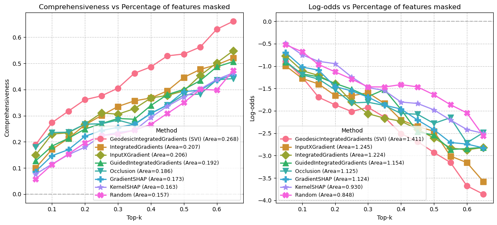

# Geodesic Integrated Gradients
<p align="center"> <table> <tr> <td align="center">  <br> <em>IG (left) vs Geodesic IG (right)</em> </td> <td align="center">  <br> <em>A comparison of IG vs Geodesic IG for image classification</em> </td> </tr> </table> </p>
This repository accompanies our paper, “Using the Path of Least Resistance to Explain Deep Networks.”

Integrated Gradients (IG) is a widely used path-based method for explaining Deep Learning model decisions. While effective in certain cases, we show that IG can produce flawed explanations under specific circumstances. To address this, we introduce a novel attribution method that leverages Differential Geometry to mitigate these issues.

The repository contains two key experiments:
- [Explaining ConvNeXt image classifications on the VOC dataset](./experiments/voc/)
- [Explaining classifications of an MLP on the Half Moons dataset](./experiments/moons/)

The images above illustrate a qualitative comparison of the two methods for each experiment. In the Half Moons example, as expected, the Geodesic method produces consistent explanations for data points within the same half-moon, whereas standard IG fails to do so. In the image classification experiment, the Geodesic method better highlights the classified duck, while standard IG struggles. For further details, refer to our paper.

Below, we present a quantitative evaluation of our method against several others. We observe improvements of 29% and 15% over IG, measured by Comprehensiveness and Log-Odds metrics, respectively. More details can be found in our paper.

<p align="center"> <table> <tr> <td align="center">  <br> <em>A quantitative comparison of Geodesic IG with other methods.</em> </td> </tr> </table> </p>

## Installation

### Using pip
```bash
pip install geodesic-ig
```
### From source
```bash
git clone https://github.com/yourusername/geodesic-ig.git
cd geodesic-ig
pip install .
```
### Quick Start

```python
from geodesic.attr import GeodesicIGSVI, GeodesicIGKNN
knn_explainer = GeodesicIGKNN(net)
knn_attributions = explainer.attribute(
                    x_test,
                    baselines=baselines,
                    target=target,
                    n_neighbors=n,
                    internal_batch_size=200,
                    )

svi_expliner = GeodesicIGSVI(net)
svi_attributions = explainer.attribute(
                    x_test,
                    baselines=baselines,
                    target=terget,
                    num_iterations=num_iterations,
                    beta=beta,
                    n_steps=n_steps,
                    do_linear_interp=li,
                    use_endpoints_matching=em, learning_rate=learning_rat,
                    )
```

For more detailed examples see:
- [VOC Image Classification Experiment](./experiments/voc/)
- [Half Moons Experiment](./experiments/moons/)